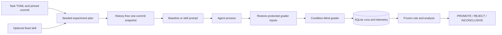

# Forge

Forge is a standard-library runtime for controlled, evidence-driven evaluation
of procedural skills for coding agents. It asks a narrow research question:
does giving the same agent a fixed procedure improve task success over an
otherwise identical baseline, and at what operational cost?

Forge was built because a prompt comparison is only useful when repository
state, model settings, grading, trial order, telemetry, and decision rules are
controlled and recoverable. It creates a seeded run plan, isolates every run in
a history-free Git snapshot, restores protected grader inputs after the agent
exits, and records append-only observations in SQLite.

## V1 Result

The frozen held-out experiment `systematic-debugging-final-v1` evaluated 15
tasks with five trials per condition using `gpt-5.6-sol` at medium reasoning.
Both baseline and Systematic Debugging v2 passed 75/75 observations. The mean
task-level success effect was 0.00 percentage points (task-clustered 95% CI
0.00 to 0.00), so the frozen verdict was **REJECT: effect_below_threshold**.

This rejects promotion under the precommitted rule; it does not establish that
procedural skills are universally ineffective. All baseline runs passed, so the
benchmark saturated and could not reveal a positive binary success effect.
Skill runs used 4.09% fewer median tokens, but the CI was -14.46% to +3.17% and
this comparison does not identify the effect of the pilot-informed v2 revision
relative to v1. See the [research report](docs/RESEARCH_REPORT.md) and
[reproducibility audit](docs/REPRODUCIBILITY_AUDIT.md).

## Architecture



The baseline receives the task prompt byte-for-byte. The treatment receives a
versioned template containing the fixed skill followed by the same task prompt.
Both conditions otherwise share the task snapshot, model, reasoning effort,
environment allowlist, sandbox, timeouts, and grader.

Each run exports only the tree at `base_commit`, initializes a fresh repository
with one commit and no remote, and deletes it afterward. Before grading, Forge
restores or removes protected tests, Python startup hooks, stdlib-shadowing
modules, and relevant test configuration to their snapshot state. The grader
does not receive the condition label. Exit 0 means solved, exit 1 means not
solved, and any other exit is `grader_error`, following pytest conventions.

## Install And Test

Forge requires Python 3.11 or newer and Git. Runtime code has no third-party
dependencies.

```sh
python3 -m venv .venv
source .venv/bin/activate
python3 -m pip install -e ".[dev]"
pytest
```

## Small Experiment

First validate each task definition and its optional reference commit:

```sh
forge validate-task tasks/example.toml --db runs.sqlite
```

A minimal command-adapter manifest is flat TOML:

```toml
experiment_id = "example-pilot-v1"
phase = "pilot"
db = "runs.sqlite"
tasks = ["tasks/example.toml"]
conditions = ["baseline", "skill"]
skill = "skills/example/SKILL.md"
skill_id = "example-v1"
trials_per_condition = 3
seed = 12345
agent = "cmd"
argv = ["python3", "stub_agent.py"]
max_total_runs = 8
max_total_tokens = 1000000
```

Inspect the persisted plan without launching an agent, then run or resume it:

```sh
forge run-experiment experiment.toml --plan-only
forge run-experiment experiment.toml
```

For Codex, set `agent = "codex"`, an explicit `model`, and
`reasoning_effort`. Forge passes the prompt on stdin to `codex exec --json
--sandbox workspace-write`, uses a private temporary `CODEX_HOME` containing
only a copied `auth.json`, and records tokens, command/file-change counts,
latency, model, effort, and CLI version. Run logs may contain secrets if an
agent reads credentials; never commit or share them.

## Freeze And Analyze

Pilot analysis is development information. A final experiment must be frozen
before its first run, binding the manifest, benchmark, skill, promotion rule,
and analysis source hashes:

```sh
forge freeze final.toml --db final.sqlite --rule final-rule.toml
forge run-experiment final.toml
forge analyze --db final.sqlite --experiment-id final-v1 \
  --rule final-rule.toml --out report.md
```

Analysis computes task-level baseline/skill pass-rate differences and a
task-clustered bootstrap interval. The first final analysis is stored
immutably; later calls must reproduce it exactly.

- **PROMOTE**: the lower confidence bound exceeds the minimum effect and all
  health and cost guardrails pass.
- **REJECT**: adequate healthy data place the effect below the promotion
  threshold, or an otherwise qualifying effect violates a guardrail.
- **INCONCLUSIVE**: health, completeness, sample size, interval position, or
  data integrity prevents either decision.

The precommitted V1 rule and held-out package are in
[`benchmarks/final`](benchmarks/final/README.md). A no-agent walkthrough using
the recorded database is in [the CLI demonstration](docs/DEMO.md).

## Security And Scope

Forge provides experimental isolation, not a hardened security boundary. An
agent that knows the canonical repository path can read it. A process that
creates a new session may escape process-group cleanup. Codex sandboxing limits
writes but can still permit reads from the real home directory. Exact copied
credential strings are redacted when detected, but encoded or transformed
secrets may evade detection; credential rotation in the temporary home can
also invalidate the real login.

Forge V1 evaluates specified post-run behavior only. It does not measure
regressions of tests that already passed, semantic code quality beyond the
grader, external validity to large repositories, or adversaries with knowledge
of host paths. These limits are part of the reported result, not footnotes to
it.

## License

Copyright 2026 Matiyas Dawit. Licensed under the
[Apache License 2.0](LICENSE). See [NOTICE](NOTICE) for attribution.
